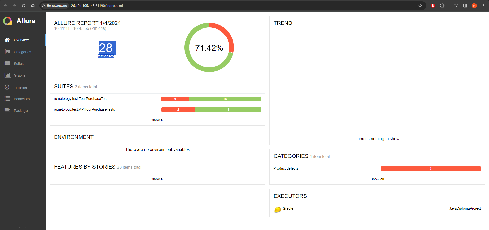
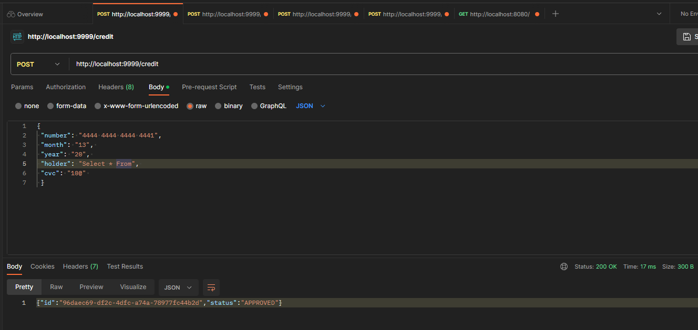

# Отчётные документы по итогам тестирования.

#### краткое описание
При тестирование приложения aqa-shop были обнаружены критические проблемы.

#### количество тест-кейсов
Всего было обработано 28 тест кейсов.

#### процент успешных и не успешных тест-кейсов

#### общие рекомендации
## общие рекомендации для UI
Для поля "Владелец" сделать ограничение на ввод, например только буквы кириллицы и латиницы.
## общие рекомендации для API
Для полей "month", "year", "holder", "cvc" нужно ограничение на формат данных передаваемых по API. 
Так как при передачи некорректных данных по API происходит успешное выполнение запроса.

